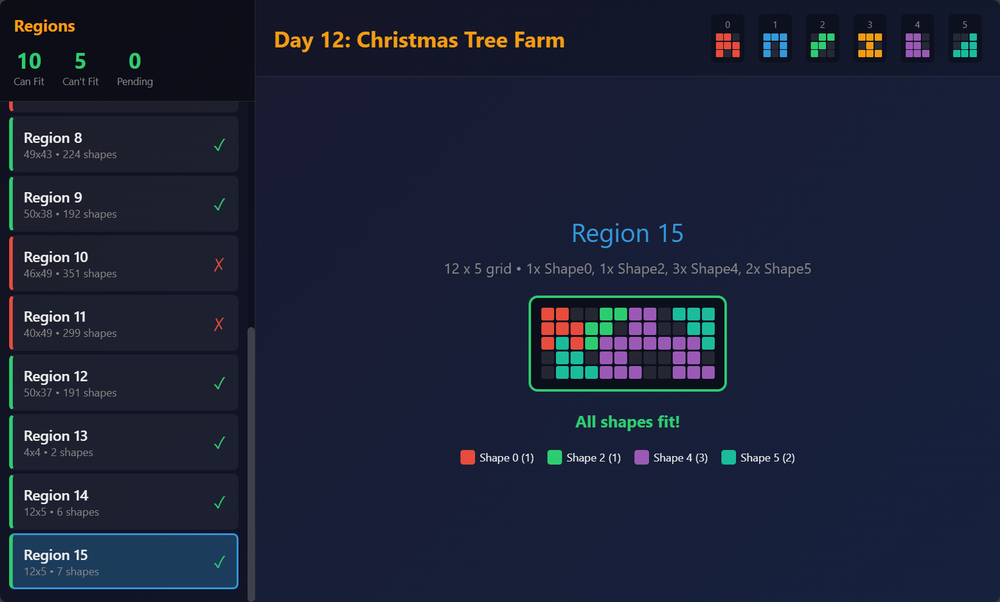
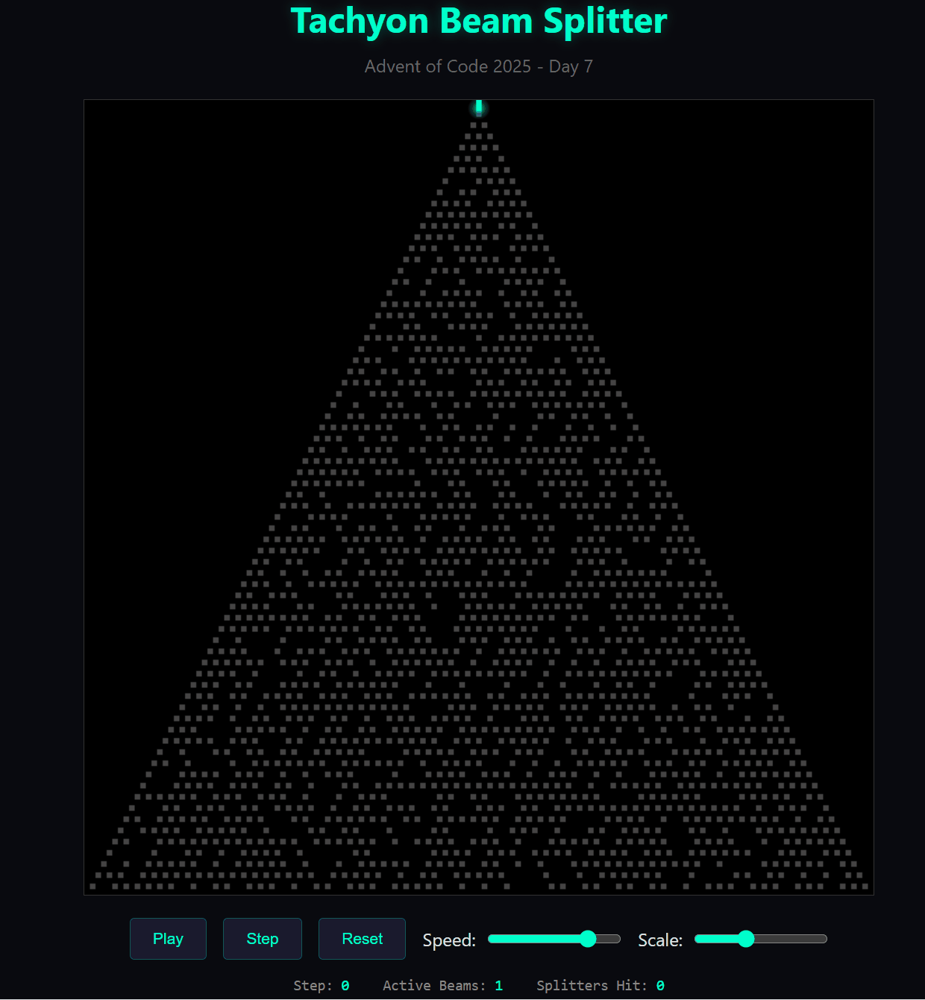
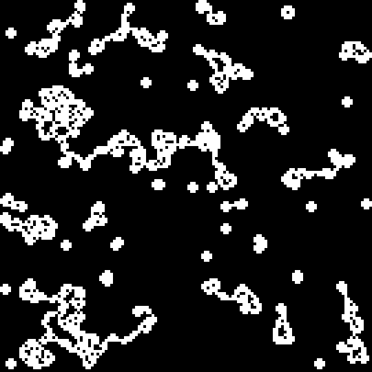

# AdventOfCode 2025

**[View Interactive Visualizations](https://andrewboudreau.github.io/AdventOfCode_2025/)**

## Build & Run

```bash
# Build entire solution
dotnet build AdventOfCode_2025.sln

# Run a specific day
dotnet run --project Day01 -- Day01/problem.txt
```

## Project Structure

| Folder | Description |
|--------|-------------|
| Day00  | Shared utilities library |
| Day01+ | Daily puzzle solutions |


## Solutions

| Day | Puzzle | Solution |
|-----|--------|----------|
| 1 | [Secret Entrance](https://adventofcode.com/2025/day/1) | [Day01](Day01/) |
| 2 | [Gift Shop](https://adventofcode.com/2025/day/2) | [Day02](Day02/) |
| 3 | [Lobby](https://adventofcode.com/2025/day/3) | [Day03](Day03/) |
| 4 | [Printing Department](https://adventofcode.com/2025/day/4) | [Day04](Day04/) |
| 5 | [Cafeteria](https://adventofcode.com/2025/day/5) | [Day05](Day05/) |
| 6 | [Trash Compactor](https://adventofcode.com/2025/day/6) | [Day06](Day06/) |
| 7 | [Laboratories](https://adventofcode.com/2025/day/7) | [Day07](Day07/) |
| 8 | [Playground](https://adventofcode.com/2025/day/8) | [Day08](Day08/) |
| 9 | [Movie Theater](https://adventofcode.com/2025/day/9) | [Day09](Day09/) |
| 10 | [Assembly Line](https://adventofcode.com/2025/day/10) | [Day10](Day10/) |
| 11 | [Reactor Graph](https://adventofcode.com/2025/day/11) | [Day11](Day11/) |
| 12 | [Christmas Tree Farm](https://adventofcode.com/2025/day/12) | [Day12](Day12/) |

## Visualizations

### Day 12 - Christmas Tree Farm (Shape Packing)
Interactive polyomino packing visualizer - click regions to solve and see color-coded shape placements:



### Day 11 - Reactor Graph
Paths from `you`/`svr` to `out` through required waypoints are highlighted; node colors follow the legend from `Day11/visualize.html`.


### Day 8 - Playground (Christmas Light Circuits)
Kruskal's algorithm connects 1000 junction boxes by shortest distance, forming circuits colored by size (red=largest, green=2nd, blue=3rd):


### Day 7 - Laboratories (Tachyon Beam Splitter)
Beams propagate downward and split at each `^` splitter, branching left and right:



### Day 4 - Printing Department
Final grid state after removing all accessible paper rolls (white = remaining rolls, black = empty):



## Day00 Utilities

| File | Description |
|------|-------------|
| ReadInputs.cs | Span-based input parsing from files or stdin |
| ReadInputExtensions.cs | Convenience methods for reading integers, records |
| Grid.cs | 2D grid with neighbor traversal, BFS, region detection |
| GridRenderExtensions.cs | Grid rendering including bitmap export |
| Node.cs | Grid node with position, value, distance, visited state |
| SimulationGrid.cs | Sparse grid for simulations with viewport rendering |
| Graph.cs | Generic graph with pathfinding |
| Line.cs | 2D line segment with path enumeration |
| CircularRange.cs | Circular number range with zero-crossing tracking |
| CircularEnumerable.cs | Infinitely repeating sequence |
| EnumerableExtensions.cs | Collection helpers (SplitToInts, Second, Third, etc.) |
| CombinatoricsEnumerableExtensions.cs | Permutations, combinations |
| StringParsingExtensions.cs | ParseInt, ParseIntegers, ParseLongs |
| ArrayExtensions.cs | Array utilities |
| RenderExtensions.cs | Fluent .ToConsole() for output |
| Cards.cs | Playing card utilities |
| EnumerableTuples.cs | Tuple enumeration helpers |


[2025 Advent of Code](https://adventofcode.com) Solutions in C#
